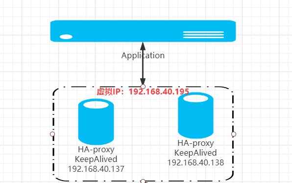

# HAPorxy+keepalived
## 一、环境准备
| 软件  | 版本  |
| ------------ | ------------ |
| CentOS  | 7.9  |
| HA-proxy  | v1.5.18  |
| keepalived  | v1.3.5  |

| IP  | 组件  |
 | ------------ | ------------ |
| 192.168.40.137  | HA-proxy keepalived  |
| 192.168.40.138  | HA-proxy keepalived  |

网络拓扑图:



## 一、HAProxy
安装haproxy
```
rpm  -ivh  haproxy-1.5.18-9.el7.x86_64.rpm
```

备份旧的配置中文件
```
mv   /etc/haproxy/haproxy.cfg   /etc/haproxy/haproxy.cfg_default
```
HAProxy配置文件
```
cat  >>   /etc/haproxy/haproxy.cfg   << EOF
# 参数是进程级的，通常和操作系统（OS）相关
global
    #以指定的uid和gid运行
    uid 99
    gid 99
    daemon
    quiet
    #指定启动的haproxy进程的个数
    nbproc 20
    pidfile /var/run/haproxy.pid
    #指定haproxy的工作目录
    chroot /var/lib/haproxy
    log 127.0.0.1 local0 info
    #每个haproxy进程所接受的最大并发连接数
    maxconn 5120

defaults
    log global
    # 使用四层代理模式,"mode http" 为7层代理模式
    mode tcp
    # if you set mode to tcp,then you must change httplog  into tcplog
    option tcplog
    option dontlognull
    option redispatch
    maxconn 2000
    contimeout 5s
    # 客户端空闲超时时间为60秒，过了该时间，HA发起重连机制
    clitimeout 60s
    # 服务端连接超时时间为15秒，过了该时间，HA发起重连机制
    srvtimeout 15s
    retries 3

# 配置 haproxy web 监控，查看统计信息
listen stats
    bind *:8100
    mode http
    option httplog
    stats enable
    # 设置 haproxy 监控地址为：http://localhost:8100/haproxy
    stats uri /haproxy
    stats refresh 5s
EOF
```

启动haproxy
```
systemctl  start  haproxy
systemctl  status  haproxy
systemctl  enable  haproxy
```
web界面访问： http://192.168.40.137:8100/haproxy

## 二、keepalived
rpm安装
```
rpm  -ivh    net-snmp-libs-5.7.2-49.el7_9.1.x86_64.rpm
rpm  -ivh    lm_sensors-libs-3.4.0-8.20160601gitf9185e5.el7.x86_64.rpm
rpm  -ivh    net-snmp-agent-libs-5.7.2-49.el7_9.1.x86_64.rpm
rpm  -ivh    ipset-libs-7.1-1.el7.x86_64.rpm
rpm  -ivh    keepalived-1.3.5-19.el7.x86_64.rpm
```

192.168.40.137
```
mv   /etc/keepalived/keepalived.conf     /etc/keepalived/keepalived.conf_default
```

```
cat  >>    /etc/keepalived/keepalived.conf   <<  EOF
#这个脚本检查haproxy正不正常，如果不正常，就实现故障转移
vrrp_script check_haproxy {
    script "/home/oyb/check_haproxy.sh"
}
vrrp_instance VI_1 {
    state MASTER            # 角色
    interface ens33         # 网卡名称
    virtual_router_id 40    # VRRP路由ID实例
    priority 100            # 值越大优先级越高
    advert_int 1            # 指定VRRP 心跳包通告间隔时间，默认1秒
    authentication {
        auth_type PASS
        auth_pass 1111
    }
    virtual_ipaddress {
        192.168.40.195/24
    }
   #使用这个脚本定期检查
    track_script {
        check_haproxy
    }
}
EOF
```

192.168.40.138
```
mv   /etc/keepalived/keepalived.conf    /etc/keepalived/keepalived.conf_default
```

```
cat  >>  /etc/keepalived/keepalived.conf   <<  EOF
vrrp_script check_haproxy {
    script "/home/git/check_haproxy.sh"
}
vrrp_instance VI_1 {
    state BACKUP            # 角色
    interface ens33         # 网卡名称
    virtual_router_id 40    # VRRP路由ID实例
    priority 90             # 值越大优先级越高
    advert_int 1            # 指定VRRP 心跳包通告间隔时间，默认1秒
    authentication {
        auth_type PASS
        auth_pass 1111
    }
    virtual_ipaddress {
        192.168.40.195/24
    }
   #使用这个脚本定期检查
    track_script {
        check_haproxy
    }
}
EOF
```

## 三、注意事项
- 1、state 角色状态有一个指定为MASTER，其他为BACKUP
- 2、interface要指定你当前机器的网卡名字
- 3、优先级master要设置比其他BACKUP高，这样master挂掉恢复之后，还可以把虚拟IP抢回来，BACKUP之间优先级也要有高低
- 4、指定一个虚拟IP，该虚拟IP网络中没有被使用
- 5、指定健康检查脚本路径/home/git/check_haproxy.sh

健康检查脚本
检测haproxy服务有没有挂掉，如果挂掉，就把keepalived服务停掉，那么虚拟IP就飘逸到其他client节点了
```
cat >>  /home/git/check_haproxy.sh   <<  EOF
count=$(ps -ef |grep haproxy |egrep -cv "grep|$$")
if [ "$count" -eq 0 ];then
    systemctl  stop  keepalived
fi
EOF
chmod +x  /home/git/check_haproxy.sh
```

启动keepalived
```
systemctl start keepalived
systemctl status keepalived
systemctl enable keepalived
```

在192.168.40.137上查看虚拟ip：
```
# ip addr
1: lo: <LOOPBACK,UP,LOWER_UP> mtu 65536 qdisc noqueue state UNKNOWN group default qlen 1
    link/loopback 00:00:00:00:00:00 brd 00:00:00:00:00:00
    inet 127.0.0.1/8 scope host lo
       valid_lft forever preferred_lft forever
    inet6 ::1/128 scope host
       valid_lft forever preferred_lft forever
2: ens33: <BROADCAST,MULTICAST,UP,LOWER_UP> mtu 1500 qdisc pfifo_fast state UP group default qlen 1000
    link/ether 00:0c:29:54:ec:a8 brd ff:ff:ff:ff:ff:ff
    inet 192.168.40.137/24 brd 192.168.40.255 scope global ens33
       valid_lft forever preferred_lft forever
    inet 192.168.40.195/24 scope global secondary ens33
       valid_lft forever preferred_lft forever
    inet6 fe80::6491:b30d:b588:921b/64 scope link
       valid_lft forever preferred_lft forever
```
可以看到 192.168.40.195/24  这个 虚拟IP地址
