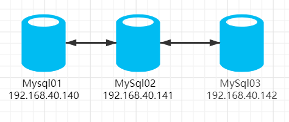

# MySQL集群
## 一、环境规划
| 软件  |  版本  |
| ------------ | ------------ |
| centos  | 7.9  |
| Percona-XtraDB-Cluster  | v5.6.45  |

| 角色  | IP  | 组件  |
| ------------ | ------------ | ------------ |
| node1  | 192.168.40.140  | Percona-XtraDB-Cluster |
| node2  | 192.168.40.141  | Percona-XtraDB-Cluster  |
| node3  | 192.168.40.142  | Percona-XtraDB-Cluster  |

网络拓扑图:



## 二、安装PXC
安装依赖
```
yum install perl-IO-Socket-SSL perl-DBD-MySQL perl-Time-HiRes socat nc -y
```
安装xtrabackup
```
yum install https://repo.percona.com/yum/percona-release-latest.noarch.rpm
yum install -y percona-xtrabackup-24.x86_64
```

软件包下载与解压
```
tar  -xzvf      Percona-XtraDB-Cluster-5.6.45-rel86.1-28.36.1.Linux.x86_64.ssl101.tar.gz
mv   Percona-XtraDB-Cluster-5.6.45-rel86.1-28.36.1.Linux.x86_64.ssl101   /opt/mysql
```

创建相关目录并修改权限
```
mkdir   -p /opt/mysql/data
mkdir   -p  /opt/mysql/logs
useradd  mysql
chown    -R mysql:mysql   /opt/mysql
```

配置MySQL环境变量
```
cat   >>  ~/.bash_profile  << EOF
export    PATH=\$PATH:/opt/mysql/bin
EOF
source  ~/.bash_profile
```

## 三、配置文件
 node1
初始化数据库
```
/opt/mysql/scripts/mysql_install_db    --user=mysql    --basedir=/opt/mysql   --datadir=/opt/mysql/data
```
**注意：**node2和node3不需要初始化数据库

```
cat  >>  /opt/mysql/my.cnf   << EOF
[mysql]
socket=/tmp/mysql.sock
character-set-server=utf8
[client]
socket=/tmp/mysql.sock
[mysqld]
user = mysql
port=3306
socket=/tmp/mysql.sock
pid-file=/opt/mysql/mysqld.pid
character-set-server=utf8
collation-server = utf8_general_ci
basedir=/opt/mysql
datadir=/opt/mysql/data
log-error=/opt/mysql/logs/mysqld.log
max_connections = 1024
server-id = 121
# PXC
wsrep_provider=/opt/mysql/lib/libgalera_smm.so
wsrep_cluster_name=pxc-cluster
wsrep_cluster_address=gcomm://192.168.40.121,192.168.40.122,192.168.40.161
wsrep_node_name=pxc1
wsrep_node_address=192.168.40.121
wsrep_sst_method=xtrabackup-v2
wsrep_sst_auth=sst:fxgjpwd
default_storage_engine=InnoDB
EOF
```
node2
node2和node3 只需要修改 server-id，wsrep_node_name 以及 wsrep_node_address 这三个参数
```
server-id = 122
wsrep_node_name=pxc2
wsrep_node_address=192.168.40.122
```

```
cat  >>  /opt/mysql/my.cnf   << EOF
[mysql]
socket=/tmp/mysql.sock
character-set-server=utf8
[client]
socket=/tmp/mysql.sock
[mysqld]
user = mysql
port=3306
socket=/tmp/mysql.sock
pid-file=/opt/mysql/mysqld.pid
character-set-server=utf8
collation-server = utf8_general_ci
basedir=/opt/mysql
datadir=/opt/mysql/data
log-error=/opt/mysql/logs/mysqld.log
max_connections = 1024
server-id = 122
# PXC
wsrep_provider=/opt/mysql/lib/libgalera_smm.so
wsrep_cluster_name=pxc-cluster
wsrep_cluster_address=gcomm://192.168.40.121,192.168.40.122,192.168.40.161
wsrep_node_name=pxc2
wsrep_node_address=192.168.40.122
wsrep_sst_method=xtrabackup-v2
wsrep_sst_auth=sst:fxgjpwd
default_storage_engine=InnoDB
EOF
```


node3

```
cat  >>  /opt/mysql/my.cnf   << EOF
[mysql]
socket=/tmp/mysql.sock
character-set-server=utf8
[client]
socket=/tmp/mysql.sock
[mysqld]
user = mysql
port=3306
socket=/tmp/mysql.sock
pid-file=/opt/mysql/mysqld.pid
character-set-server=utf8
collation-server = utf8_general_ci
basedir=/opt/mysql
datadir=/opt/mysql/data
log-error=/opt/mysql/logs/mysqld.log
max_connections = 1024
server-id = 161
# PXC
wsrep_provider=/opt/mysql/lib/libgalera_smm.so
wsrep_cluster_name=pxc-cluster
wsrep_cluster_address=gcomm://192.168.40.121,192.168.40.122,192.168.40.161
wsrep_node_name=pxc3
wsrep_node_address=192.168.40.161
wsrep_sst_method=xtrabackup-v2
wsrep_sst_auth=sst:fxgjpwd
default_storage_engine=InnoDB
EOF
```

## 四、启动
启动第一个节点：
第一个节点启动需要使用 --wsrep-new-cluster 参数
```
/opt/mysql/bin/mysqld --defaults-file=/opt/mysql/my.cnf    --wsrep-new-cluster &
```

创建sst用户
```
mysql  -uroot  -p
grant reload, lock tables, replication client, process on *.* to 'sst'@'localhost' identified by 'fxgjpwd';
flush privileges;
```

第二、三个节点启动：
```
/opt/mysql/bin/mysqld --defaults-file=/opt/mysql/my.cnf &
```

## 五、查看集群状态
查看集群成员地址:
```
show variables like 'wsrep_cluster_address';
```

查看集群成员数量：
可以看到集群中有 3 个节点
```
show global status like 'wsrep_cluster_size';
```

查看集群状态：
```
show status like 'wsrep%';
```
```
wsrep_local_state=4
wsrep_local_state_comment = Synced
wsrep_cluster_status = Primary
wsrep_connected = ON
```

## 六、HAProxy配置
```
cat  >>  /etc/haproxy/haproxy.cfg  << EOF
# listen：Frontend和Backend的组合体
listen Mysql_cluster
    # 定义监听地址和端口
    bind 0.0.0.0:3306
    # 配置 tcp 模式
    mode tcp
    # 简单的轮询
    balance roundrobin
    #check 后端健康检测
    #inter 每隔五秒对集群做健康检查，2次正确证明服务器可用，
    #2次失败证明服务器不可用，并且配置主备机制
    server node1 192.168.40.140:3306 check inter 5000 rise 2 fall 2
    server node2 192.168.40.141:3306 check inter 5000 rise 2 fall 2
    server node3 192.168.40.142:3306 check inter 5000 rise 2 fall 2
EOF
```

```
systemctl  restart   haproxy
```
