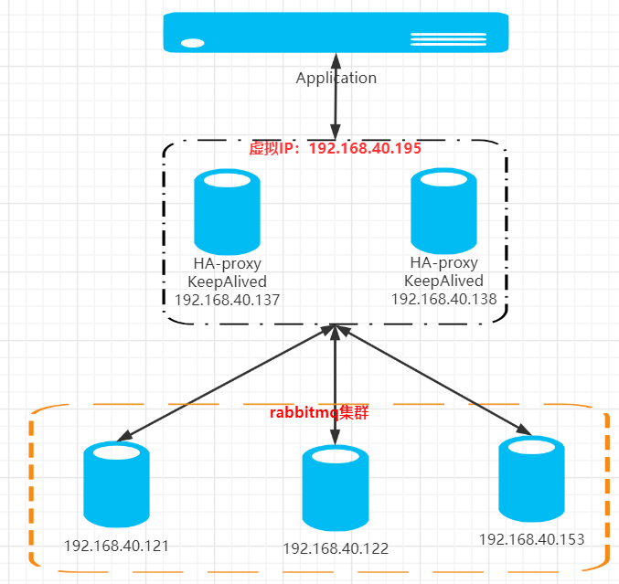

# RabbitMQ集群
## 一、环境准备
| 软件  | 版本  |
| ------------ | ------------ |
| CentOS  | 7.9  |
| erlang  | v22.0  |
| rabbitmq  | v3.7.17  |

| 主机名  | IP  | 组件  |  |
| ------------ | ------------ | ------------ | ------------ |
| node1  | 192.168.40.121  | rabbitmq  | 主节点 |
| node2  | 192.168.40.122  | rabbitmq  | 从节点 |
| node3  | 192.168.40.153  | rabbitmq  | 从节点 |

node1、node2、node为rabbitmq集群，其中node1作为主节点，node2、node3作为从节点，

网络拓补图：


## 二、RabbitMQ安装

安装依赖包
挂在镜像盘，然后从镜像盘里面安装这些依赖包
```
yum -y install make gcc gcc-c++ kernel-devel m4 ncurses-devel libxml2 libxslt openssl-devel unixODBC unixODBC-devel gtk2 fop gtk2-devel binutils-devel mesa-libGLU-devel
```

erlang源码安装
```
tar -xvf otp_src_22.0.tar.gz
cd otp_src_22.0
mkdir    /opt/erlang
./configure --prefix=/opt/erlang
make  &&  make  install
```

```
tar  -xvf  rabbitmq-server-generic-unix-3.7.17.tar
mv     rabbitmq_server-3.7.17       /opt
```

环境变量
```
cat  >>   ~/.bash_profile   <<  EOF
export ERLANG_HOME=/opt/erlang
export PATH=\${PATH}:\${ERLANG_HOME}/bin
export RABBITMQ_HOME=/opt/rabbitmq_server-3.7.17
export PATH=\${PATH}:\${RABBITMQ_HOME}/sbin
EOF
source  ~/.bash_profile
```

启动
```
rabbitmq-server  &
```

## 三、启用管理控制台
设置guest可以远程连接，没有rabbitmq.config就新建
```
cat >>   /opt/rabbitmq_server-3.7.17/etc/rabbitmq/rabbitmq.config    << EOF
[{rabbit, [{loopback_users, []}]}].
EOF
```

启用管理控制台
```
rabbitmq-plugins enable rabbitmq_management
```

重启 rabbitmq生效
```
rabbitmqctl stop
rabbitmq-server &
```
打开浏览器访问:http://192.168.40.121:15672，用户名guest，密码guest


## 四、RabbitMQ集群配置
同步erlang.cookie文件
RabbitMQ是依附于erlang进行通信，想要通信必须有相同的.erlang.cookie文件

主节点
- 192.168.40.121

复制主节点的 ~/.erlang.cookie文件到其他slave节点，并覆盖
```
scp   ~/.erlang.cookie    root@192.168.40.122:~
scp   ~/.erlang.cookie     root@192.168.40.153:~
```

停止mq服务
```
rabbitmqctl stop
```

启动集群
```
rabbitmq-server -datached  &
```

从节点
- 192.168.40.122和192.168.40.153

.erlang.cookie文件被替换后，需要重新启动生效,这里需要注意，如果重新启动失败，可以kill掉所有和RabbitMQ相关的进程
```
rabbitmqctl stop
rabbitmq-server &
```
Slave加入集群
HOSTS文件都配置3个的主机名IP映射
```
cat >>  /etc/hosts << EOF
192.168.40.121  node1
192.168.40.122  node2
192.168.40.153  node3
EOF
```

rabbitmqctl stop_app停止rabbitmq应用，但不停止erlang,join_cluster后面要指定192.168.40.121的主机名
```
rabbitmqctl stop_app
rabbitmqctl reset
rabbitmqctl join_cluster rabbit@node1
rabbitmqctl start_app
```

任意节点进行的查看集群状态
```
rabbitmqctl cluster_status
```
移除集群节点
```
rabbitmqctl forget_cluster_node rabbit@node2(具体节点)
```
修改集群名称
```
rabbitmqctl set_cluster_name rabbitmq_cluster1
```

设置镜像队列策略
任意一个节点操作
将所有队列设置为镜像队列，即队列会被复制到各个节点，各个节点状态一致。
```
rabbitmqctl set_policy ha-all "^" '{"ha-mode":"all"}'
```


## 四、安装延迟队列插件
上传延迟队列插件
```
cp  rabbitmq_delayed_message_exchange-3.8.0.ez    /opt/rabbitmq_server-3.7.17/plugins/
```

开启插件：
```
rabbitmq-plugins enable rabbitmq_delayed_message_exchange
```

查询安装的所有插件：
```
rabbitmq-plugins list
```
看到这个查看rabbitmq_delayed_message_exchange 3.8.0表示安装成功

重启生效
```
rabbitmqctl stop
rabbitmq-server   &
```

## 五、HAProxy配置
```
cat  >>  /etc/haproxy/haproxy.cfg  << EOF
# listen：Frontend和Backend的组合体
listen rabbitmq_cluster
    # 定义监听地址和端口
    bind 0.0.0.0:5672
    # 配置 tcp 模式
    mode tcp
    # 简单的轮询
    balance roundrobin
    #check 后端健康检测
    #inter 每隔五秒对mq集群做健康检查，2次正确证明服务器可用，
    #2次失败证明服务器不可用，并且配置主备机制
    server node1 192.168.40.121:5672 check inter 5000 rise 2 fall 2
    server node2 192.168.40.122:5672 check inter 5000 rise 2 fall 2
    server node3 192.168.40.153:5672 check inter 5000 rise 2 fall 2
EOF
```

```
systemctl  restart  haproxy
```
