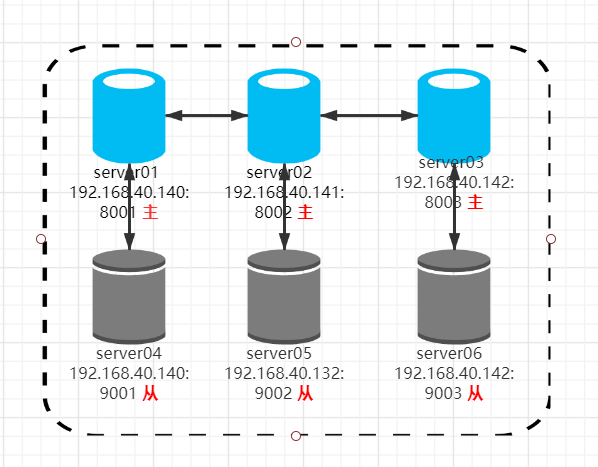

# Redis集群
## 一、环境规划
| 软件  |  版本  |
| ------------ | ------------ |
| centos  | 7.9  |
| redis  | v5.0.8  |

|IP |192.168.40.140  | 192.168.40.141  | 192.168.40.142  |
|--- |------------ | ------------ | ------------ |
|主节点 |8001  | 8002  | 8003  |
|备节点 |9001  | 9002  | 9003  |

网络拓扑图:



## 二、安装Redis
安装依赖
```
yum  -y  install gcc
```
下载、解压、编译安装
```
wget http://download.redis.io/releases/redis-5.0.8.tar.gz
tar -xzvf  redis-5.0.8.tar.gz
cd   redis-5.0.8
mkdir  /opt/redis
make   CFLAGS="-march=x86-64"    PREFIX=/opt/redis  install
```
创建数据和日志等目录
```
mkdir  -p   /opt/redis/{etc,data,logs}
```

配置环境变量
```
cat  >>    ~/.bash_profile  << EOF
export REDIS_HOME=/opt/redis
export PATH=\$PATH:\$REDIS_HOME/bin
EOF
source  ~/.bash_profile
```

## 三、Redis配置文件
3.1、192.168.40.140
```
mkdir  -p /opt/redis/data/8001
mkdir  -p /opt/redis/data/9001
```

```
cat >>  /opt/redis/etc/redis_8001.conf  <<  EOF
daemonize yes
bind 0.0.0.0
port 8001
dir /opt/redis/data/8001
pidfile /opt/redis/8001.pid
logfile /opt/redis/logs/redis-8001.log

cluster-enabled yes
cluster-config-file /opt/redis/etc/redis-cluster-8001.conf
cluster-node-timeout 10000
appendonly yes
EOF
```

```
cat >>  /opt/redis/etc/redis_9001.conf  <<  EOF
daemonize yes
bind 0.0.0.0
port 9001
dir /opt/redis/data/9001
pidfile /opt/redis/9001.pid
logfile /opt/redis/logs/redis-9001.log

cluster-enabled yes
cluster-config-file /opt/redis/etc/redis-cluster-9001.conf
cluster-node-timeout 10000
appendonly yes
EOF
```

启动
```
/opt/redis/bin/redis-server    /opt/redis/etc/redis_8001.conf   &
/opt/redis/bin/redis-server    /opt/redis/etc/redis_9001.conf   &
```

3.2、192.168.40.141
```
mkdir  -p /opt/redis/data/8002
mkdir  -p /opt/redis/data/9002
```

```
cat  >> /opt/redis/etc/redis_8002.conf   << EOF
daemonize yes
bind 0.0.0.0
port 8002
dir /opt/redis/data/8002
pidfile /opt/redis/8002.pid
logfile /opt/redis/logs/redis-8002.log

cluster-enabled yes
cluster-config-file /opt/redis/etc/redis-cluster-8002.conf
cluster-node-timeout 10000
appendonly yes
EOF
```

```
cat   >>    /opt/redis/etc/redis_9002.conf   <<  EOF
daemonize yes
bind 0.0.0.0
port 9002
dir /opt/redis/data/9002
pidfile /opt/redis/9002.pid
logfile /opt/redis/logs/redis-9002.log

cluster-enabled yes
cluster-config-file /opt/redis/etc/redis-cluster-9002.conf
cluster-node-timeout 10000
appendonly yes
EOF
```

```
/opt/redis/bin/redis-server    /opt/redis/etc/redis_8002.conf   &
/opt/redis/bin/redis-server    /opt/redis/etc/redis_9002.conf   &
```
3.3、192.168.40.142
```
mkdir  -p /opt/redis/data/8003
mkdir  -p /opt/redis/data/9003
```
```
cat  >>  /opt/redis/etc/redis_8003.conf   << EOF
daemonize yes
bind 0.0.0.0
port 8003
dir /opt/redis/data/8003
pidfile /opt/redis/8003.pid
logfile /opt/redis/logs/redis-8003.log

cluster-enabled yes
cluster-config-file /opt/redis/etc/redis-cluster-8003.conf
cluster-node-timeout 10000
appendonly yes
EOF
```

```
cat  >>   /opt/redis/etc/redis_9003.conf   << EOF
daemonize yes
bind 0.0.0.0
port 9003
dir /opt/redis/data/9003
pidfile /opt/redis/9003.pid
logfile /opt/redis/logs/redis-9003.log

cluster-enabled yes
cluster-config-file /opt/redis/etc/redis-cluster-9003.conf
cluster-node-timeout 10000
appendonly yes
EOF
```

```
/opt/redis/bin/redis-server    /opt/redis/etc/redis_8003.conf   &
/opt/redis/bin/redis-server    /opt/redis/etc/redis_9003.conf   &
```
## 四、创建集群
```
redis-cli --cluster create 192.168.40.140:8001 192.168.40.140:9001 192.168.40.141:8002 192.168.40.141:9002 192.168.40.142:8003 192.168.40.142:9003  --cluster-replicas 1
```
\--replicas: 表示每个master有几个slave

查看状态
```
redis-cli  --cluster    check   192.168.40.140:8001
```

连接
```
redis-cli  -h   192.168.40.140   -p 8001
```

## 五、HAProxy配置
```
cat  >>  /etc/haproxy/haproxy.cfg  << EOF
# listen：Frontend和Backend的组合体
listen redis_cluster
    # 定义监听地址和端口
    bind 0.0.0.0:6379
    # 配置 tcp 模式
    mode tcp
    # 简单的轮询
    balance roundrobin
    #check 后端健康检测
    #inter 每隔五秒对集群做健康检查，2次正确证明服务器可用，
    #2次失败证明服务器不可用，并且配置主备机制
    server node1 192.168.40.140:8001 check inter 5000 rise 2 fall 2
    server node2 192.168.40.141:8002 check inter 5000 rise 2 fall 2
    server node3 192.168.40.142:8003 check inter 5000 rise 2 fall 2
    server node1 192.168.40.140:9001 check inter 5000 rise 2 fall 2
    server node2 192.168.40.141:9002 check inter 5000 rise 2 fall 2
    server node3 192.168.40.142:9003 check inter 5000 rise 2 fall 2
EOF
```

```
systemctl  restart   haproxy
```
